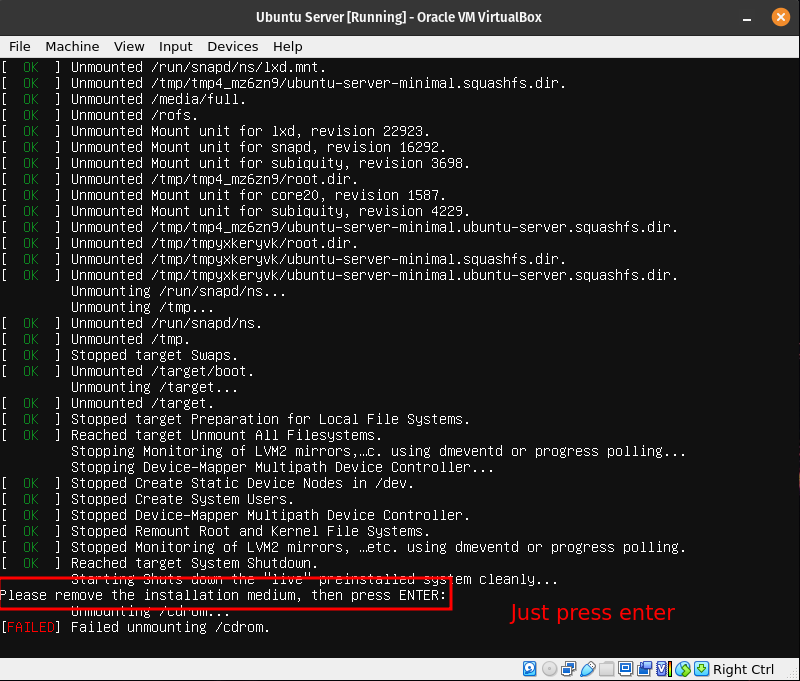

# How to Setup a Web Server in VirtualBox and Ubuntu Server 

## Introduction
Setting up a webserver is pretty to the point.  As long as there are no spelling errors it will be a quick and easy thing to do.  The server will let you host your own pages and upload files to the server from your host machine with ease.

## Basic terminology that the reader must know

### Virtualbox
 
Virtualbox is software that enables you to create virtual machines, computer OS's inside of a computer!  You can use these virtual machines to do any task, from testing files for viruses in a safe environment, to use a different OS because you feel like it, to making a web server.

### Ubuntu
 
Ubuntu is a version of linux that can come in a desktop version or a web server version.  The version for this tutorial will be the webserver version, but the desktop one is a very beginner friendly gateway into linux, so I say give it a try!  An Ubuntu Server is apart of the larger set of Ubuntu products and OS developed by Canonical Ltd.
It's a specific addition that's different from the Ubuntu you use for your desktop, and is used to
facilitate installation on servers. It can be used to setup a home network, and can assign something
called "Super Users", which have an easier time managing the network.

### Apache
 
Apache powers many websites that people use everyday, making it a pioneer for web server apps. It's available
on all platforms, default server for all CPanel shared hosting, which makes it easy to set up and
change sites, makes scripting easy with Lua, and has support for HTTP/2, compression, static files,
and load balancing.

### SSH
 
SSH, also known as Secure Shell or Secure Socket Shell, is a network protocol that gives users, mainly
system admins, a secure way to access a computer over an unsecured network. A SSH server will
always run using TCP on port 22. TCP is Transmission Control Protocol.

### Firewall
 
A system designed to prevent unauthorized access from entering a private network. It blocks
unwanted traffic, and allows wanted traffic. A safety barrier between a private network and the
internet.

## Step-by-step instructions
### Part 1 Virtual Machine

### Part 2 Install Ubuntu Server
After you creat your VM, run it and install Ubuntu Server.

Select English as the language and then update the installer if you get the prompt to.

Hit done for the default keyboard layout, or change it to your version if not default, then make sure Ubuntu Server is selected as the base.

Since we are installing Ubuntu in a virtual machine that at the moment is configured to have a NAT network interface card, as long as your host PC has internet connection, you should automatically get an IP address. If you don’t, something is wrong with your VM, Host Machine, or Internet Connection.

Leave this part empty as we are not using a proxy.

We will use the default mirror so there is no need to change this

This step is to format our disk. Here we will select the entire disk. To move around here use either the arrow keys or the tab key.

Hit Done or continue until you get to the install SSH.  We will install it now.

Hit Done to skip any addons and let the server install, it'll ask to reboot once finished.

Once it reboots, make sure you hit enter here.  And you're set!

### Part 3 Install Apache
Follow these commands in order and you'll be all set with Apache.
* sudo apt update; sudo apt upgrade -y
  * 
* sudo apt install apache2 -y
  * 

### Part 4 Setup SSH
Follow these commands to setup ssh in the server.
* sudo ufw enable
* sudo ufw allow 'Apache'
* sudo ufw allow 'OpenSSH'
* sudo ufw status
  * 
* systemctl status apache2 --no-pager
* systemctl status ssh --no-pager
  * Both should show running, if not, run this command.
  * sudo systemctl restart apache2 ssh
* Setup a network adapter, either with a bridged adapter, or via port fowarding.
  * For port fowarding, follow these steps.
  * Make sure SSH is installed in both the client and the server:
    * sudo apt install openssh -y
  * In the server, the SSH service must be already running, if it is not running, use this command to enable it and start it:
    * sudo systemctl enable ssh; sudo systemctl start ssh
  * You will need to get the IP address of the server. Use this command to get the IP address: 
    * hostname -I
  * Additionally, you can setup a static IP address in your server. Here is a guide on how to do it. If you are doing this project in your laptop, I advise to stay away from setting up static IP addresses.
  * On the client computer use this command:
    * 
  * If you are using port forwarding, your command would be:
    * ssh -p 2222 username@127.0.0.1

### Part 5 Setup virtual hosts
* Create the directory for mywebsite as follows:
  * sudo mkdir /var/www/mywebsite
* Modify the ownership of mywebsite so that it is now owned by your user instead of root
  * sudo chown -R \$USER:\$USER /var/www/mywebsite
* Now let’s change the file permission so that the owner can read, write, and execute the files while granting only read and execute permissions to groups and others:
  * sudo chmod -R 755 /var/www/mywebsite
* Now lets create a simple html document to be served from our new virtual host. Create a document with the nano text editor called index.html in the /var/www/mywebsite/ directory:
  * sudo nano /var/www/mywebsite/index.html.
* Once the new document opens, type the following text:
* \<html>
    \<head>
        \<title>My First Website\
        \</title>
    \/head>
    \<body>
        \<h1>This is a sample document!
        \</h1>
    \</body>
\</html>

* Save and close the file when you are finished. You can do this by pressing CTRL + X, then Y and ENTER.
* Now we need to create a virtual host file so that this new content can be served. The default configuration is located in /etc/apache2/sites-available/000-default.conf However, we do not need to touch this file, we can instead create a new one as it is best practice. To create a new config file, we are going to use nano again:
  * sudo nano /etc/apache2/sites-available/mywebsite.conf
* Add the following text to the domain config file:
  * \<VirtualHost *:80>
    ServerAdmin webmaster@localhost
    ServerName mywebsite
    ServerAlias www.mywebsite
    DocumentRoot /var/www/mywebsite
    ErrorLog \${APACHE_LOG_DIR}/error.log
    CustomLog \${APACHE_LOG_DIR}/access.log combined
\</VirtualHost>
* Save and close the file when you are finished. You can do this by pressing CTRL + X, then Y and ENTER.
* Now enable the site with the following command:
  * sudo a2ensite mywebsite.conf
* Now lets disable the default domain:
  * sudo a2dissite 000-default.conf
* Before we can refresh the configuration, we need to add a configuration line to the apache2.conf file. Open the file in nano:
  * sudo nano /etc/apache2/apache2.conf
* Add the following line at the end of the file:
  * ServerName 127.0.0.1
* Save and close the file when you are finished. You can do this by pressing CTRL + X, then Y and ENTER.
* Now you can test the configuration for errors:
  * sudo apache2ctl configtest
* The output of the command should look like this:
  * Syntax OK
* If there are no errors, restart Apache to apply the changes.
* Now, if you open a web browser in your host computer and go the URL: http://ip.address.of.your.server/ your index.html document should load.