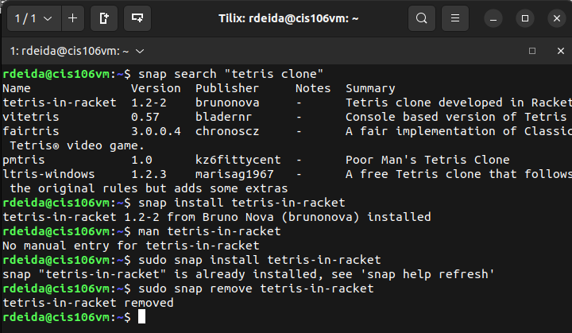

# Week Report 3
## Completed Work for week 3
* https://github.com/Snakie99/cis106/blob/main/labs/lab3/lab3.md
* https://github.com/Snakie99/cis106/blob/main/notes/notes1.md
# Bash
### Practice 1

### Practice 2

### Practice 3

### Practice 4

### Practice 5

### Practice 6

### Practice 7

# Managing Software
### Practice 1

### Practice 2

### Practice 3

### Practice 4

### Practice 5
